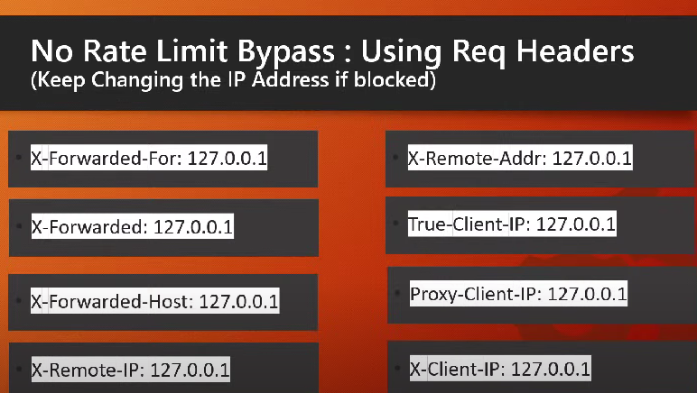
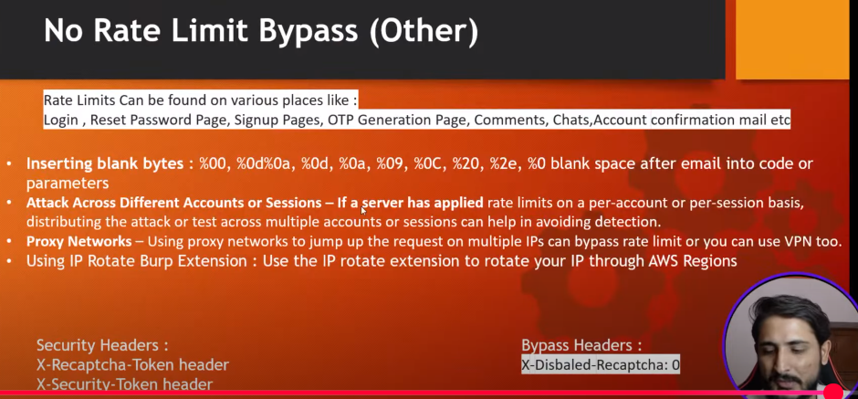

# No Rate Limit vulnerability {Business logical flaws}

## { Fist check this vulnerability is not out of scope. }

### Rate Limit: A limit that has been implemented on a server or computer which states who many request a server can process in given time frame.

- some times it can be 100 requests per secound or 1000 requests per secound acc. to the API configurations

## Defination
###  A **No Rate Limit vulnerability** happens when a website or app doesn't limit how often a user can perform a specific action within a certain time. This means attackers can abuse this by sending a massive number of requests very quickly to achieve malicious goals.

### Example:
Imagine an app where you log in by entering a username and password. If the app doesn't limit the number of login attempts:
1. An attacker can keep trying thousands of password guesses very fast using automated tools.
2. This is called a **brute-force attack**, and the lack of a rate limit makes it possible.

### Why is this bad?
- **Brute-force attacks**: Guessing passwords or PINs becomes easy.
- **Resource overload**: Attackers can flood a system with requests, slowing it down for legitimate users.
- **Exploitation of functions**: Actions like sending money, creating accounts, or redeeming coupons could be abused repeatedly.

### How to fix it:
1. **Set rate limits**: Restrict the number of requests from a single user or IP within a timeframe.
   - Example: Allow only 5 login attempts per minute.
2. **Add Captchas**: Make users prove they're human after several failed attempts.
3. **Monitor traffic**: Watch for unusual behavior or patterns of abuse.

In short: Without rate limits, bad actors can overwhelm your app and exploit it repeatedly, so always set proper controls!
.

## Methods

### Steps to Test No Rate Limit in **Burp Suite**:

1. **Set Up Proxy**: Configure your browser to route traffic through Burp Suite.

2. **Capture Request**:  
   - Go to the target feature (e.g., login, OTP, API).  
   - Intercept the request with Burp Proxy.  

3. **Send to Intruder Or Sequencer**:  
   - Right-click the request and select **Send to Intruder**.  

4. **Set Payload**:  
   - Go to **Positions** and mark the parameter to test (e.g., password, OTP).  
   - Add payloads (e.g., wordlist of passwords).  

5. **Start Attack**:  
   - Click **Start Attack** to send multiple requests.

6. **Check Responses**:  
   - Look for consistent responses (e.g., all HTTP 200 or success).  
   - If there’s no blocking or limit, it’s vulnerable.

7. **Report**: Document the issue and potential impact.

Done! 🎯

### Common Web Application Endpoints Vulnerable to Rate-Limiting Issues(Where we can found this vul.)

### **Web Endpoints Vulnerable to Rate-Limiting Issues**:

1. **Password Reset Endpoints**
   - **How**: Send multiple password reset requests in a short time.

2. **OTP Request Endpoints**
   - **How**: Request OTPs repeatedly without delay.

3. **Login Forms**
   - **How**: Try multiple login attempts with incorrect credentials.

4. **Account Enumeration (Login & Reset)**
   - **How**: Use random usernames/emails and check for different error messages.

5. **Contact/Support Forms**
   - **How**: Flood the form with multiple submissions quickly.

6. **Registration Forms**
   - **How**: Automate account creation with random data.

7. **Authentication APIs**
   - **How**: Send repeated API requests to login or reset password endpoints.

8. **Password Change Forms**
   - **How**: Attempt multiple password change requests for the same user.

9. **Email/SMS Verification Endpoints**
   - **How**: Request multiple verification codes for the same account.

10. **File Upload Systems**
    - **How**: Try uploading files rapidly or in large quantities.

11. **Captcha/Anti-bot Systems**
    - **How**: Try to bypass CAPTCHA or flood with failed attempts.

12. **Password Strength Validation**
    - **How**: Attempt to submit weak passwords repeatedly.

     